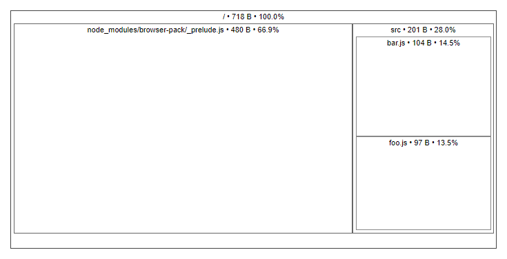

[](https://travis-ci.org/danvk/source-map-explorer)
[](https://www.npmjs.org/package/source-map-explorer)
[](https://packagephobia.now.sh/result?p=source-map-explorer)
[](https://coveralls.io/github/danvk/source-map-explorer)

# source-map-explorer
Analyze and debug JavaScript (or Sass or LESS) code bloat through source maps.

The source map explorer determines which file each byte in your minified code came from. It shows you a [treemap][] visualization to help you debug where all the code is coming from. Check out this [Chrome Developer video][video] (3:25) for a demo of the tool in action.

Install:

    npm install -g source-map-explorer

Use (you can specify filenames or use [glob](https://github.com/isaacs/node-glob) pattern):

    source-map-explorer bundle.min.js
    source-map-explorer bundle.min.js bundle.min.js.map
    source-map-explorer bundle.min.js*
    source-map-explorer *.js

This will open up a visualization of how the space is used in your minified bundle:



Here's a [demo][] with a more complex bundle.

Here's [another demo][] where you can see a bug: there are two copies of React
in the bundle (perhaps because of out-of-date dependencies).

## Requirements

- Node 10 or later

## Options

### Default behavior - write HTML to a temp file and open it in your browser
```
source-map-explorer foo.min.js
```

### Write output in specific formats to stdout
```
source-map-explorer foo.min.js --html
source-map-explorer foo.min.js --json
source-map-explorer foo.min.js --tsv
```

### Write output in specific formats to a file
```
source-map-explorer foo.min.js --html result.html
source-map-explorer foo.min.js --json result.json
source-map-explorer foo.min.js --tsv result.tsv
```

* `--json`: output JSON instead of displaying a visualization:

    ```
    source-map-explorer foo.min.js --json
    {
      "results": [
        {
          "bundleName": "tests/data/foo.min.js",
          "totalBytes": 718,
          "mappedBytes": 681,
          "unmappedBytes": 1,
          "eolBytes": 1,
          "sourceMapCommentBytes": 35,
          "files": {
            "node_modules/browser-pack/_prelude.js": {
              "size": 480
            },
            "src/bar.js": {
              "size": 104
            },
            "src/foo.js": {
              "size": 97
            },
            "[sourceMappingURL]": {
              "size": 35
            },
            "[unmapped]": {
              "size": 1
            },
            "[EOLs]": {
              "size": 1
            }
          }
        }
      ]
    }
    ```

* `--tsv`: output tab-delimited values instead of displaying a visualization:

    ```
    source-map-explorer foo.min.js --tsv
    Source                                  Size
    node_modules/browser-pack/_prelude.js   480
    src/bar.js                              104
    src/foo.js                              97
    [sourceMappingURL]                      35
    [unmapped]                              1
    [EOLs]                                  1
    ```

    If you just want a list of files, you can do `source-map-explorer foo.min.js --tsv | sed 1d | cut -f1`.

* `--html`: output HTML to stdout. If you want to save the output (e.g. to share), specify filename after `--html`:

    ```
    source-map-explorer foo.min.js --html tree.html
    ```

* `-m`, `--only-mapped`: exclude "unmapped" bytes from the output. This will result in total counts less than the file size.

* `--exclude-source-map`: exclude source map comment size from output. This will result in total counts less than the file size.

* `--replace`, `--with`: The paths in source maps sometimes have artifacts that are difficult to get rid of. These flags let you do simple find & replaces on the paths. For example:

    ```
    source-map-explorer foo.min.js --replace 'dist/' --with ''
    ```

    You can specify these flags multiple times. Be aware that the find/replace is done _after_ eliminating shared prefixes between paths.

    These are regular expressions.

* `--no-root`: By default, `source-map-explorer` finds common prefixes between all source files and eliminates them, since they add complexity to the visualization with no real benefit. But if you want to disable this behavior, set the `--no-root` flag.

* `--no-border-checks`: Disable invalid mapping column/line checks. By default, when a source map references column/line with bigger index than available in the source `source-map-explorers` throws an error indicating that specified source map might be wrong for the source.

* `--coverage`: If the path to a valid a chrome code coverage JSON export is supplied, the tree map will be colorized according to which percentage of the modules code was executed

* `--gzip`: Calculate gzip size. It also sets `onlyMapped` flag

* `--sort`: Sort filenames

<details>
<summary>Examples</summary>

### Get help
```
source-map-explorer -h
```

```
Analyze and debug space usage through source maps.
Usage:
source-map-explorer script.js [script.js.map] [--json [result.json] | --html [result.html] | --tsv [result.csv]] [-m | --only-mapped] [--exclude-source-map] [--no-border-checks] [--gzip] [--sort] [--replace=BEFORE_1 BEFORE_2 --with=AFTER_1 AFTER_2] [--no-root] [--coverage coverage.json] [--version] [--help | -h]

Output:
  --json  If filename specified save output as JSON to specified file otherwise output to stdout.  [string]
  --tsv   If filename specified save output as TSV to specified file otherwise output to stdout.  [string]
  --html  If filename specified save output as HTML to specified file otherwise output to stdout rather than opening a browser.  [string]

Replace:
  --replace  Apply a simple find/replace on source file names. This can be used to fix some oddities with paths that appear in the source map generation process. Accepts regular expressions.
  [array]
  --with     See --replace.  [array]

Options:
  --version             Show version number  [boolean]
  --only-mapped, -m     Exclude "unmapped" bytes from the output. This will result in total counts less than the file size  [boolean]
  --exclude-source-map  Exclude source map comment size from output  [boolean]
  --no-root             To simplify the visualization, source-map-explorer will remove any prefix shared by all sources. If you wish to disable this behavior, set --no-root.  [boolean]
  --no-border-checks    Disable invalid mapping column/line checks.  [boolean]
  --coverage            If the path to a valid a chrome code coverage JSON export is supplied, the tree map will be colorized according to which percentage of the modules code was executed
[string]
  --gzip                Calculate gzip size. It also sets onlyMapped flag  [boolean]
  --sort                Sort filenames  [boolean]
  -h, --help            Show help  [boolean]

Examples:
  source-map-explorer script.js script.js.map       Explore bundle
  source-map-explorer script.js                     Explore bundle with inline source map
  source-map-explorer dist/js/*.*                   Explore all bundles inside dist/js folder
  source-map-explorer script.js --tsv               Explore and output result as TSV to stdout
  source-map-explorer script.js --json result.json  Explore and save result as JSON to the file
```

### Explore bundle and view result as an interactive map
```
source-map-explorer script.js script.js.map
```
Will open an HTML file containing explore result as a tree data map


### Explore and output result as JSON
```
source-map-explorer script.js script.js.map --json
```
```
{
  "results": [
    {
      "bundleName": "script.js",
      "totalBytes": 718,
      "unmappedBytes": 1,
      "eolBytes": 1,
      "sourceMapCommentBytes": 35,
      "files": {
        "node_modules/browser-pack/_prelude.js": {
          "size": 480
        }
        "src/bar.js": {
          "size": 104
        }
        "src/foo.js": {
          "size": 97
        },
        "[sourceMappingURL]": {
          "size": 35
        }
        "[unmapped]": {
          "size": 1
        }
      }
    }
  ]
}
```
### Explore and output result as TSV
```
source-map-explorer script1.js script2.js --tsv
```
```
Source  Size
node_modules/browser-pack/_prelude.js   480
src/bar.js      104
src/foo.js      97
[sourceMappingURL]      35
[unmapped]      1

[sourceMappingURL]      2308
node_modules/browser-pack/_prelude.js   480
src/bar.js      104
src/foo.js      97
[unmapped]      1
```
### Explore and output result as HTML
```
source-map-explorer script.js --html
```
```
<!doctype html>
<html lang="en">
<head>
...
  selectBundle(selectedBundle);
</script>
<html>
```
### Explore and save result as HTML file
```
source-map-explorer script.js --html ./sme/result.html
```
### Replace substring in filenames
```
source-map-explorer script.js --tsv --replace dist node_modules --with gist modules
```
```
Source  Size
gist/bar.js     2854
modules/browserify/modules/browser-pack/_prelude.js     463
gist/foo.js     137
[unmapped]      0
```

### Remove `[unmapped]` from result files
```
source-map-explorer script.js --tsv --only-mapped
```
```
Source  Size
[sourceMappingURL]      2308
node_modules/browser-pack/_prelude.js   480
src/bar.js      104
src/foo.js      97
```

### Remove `[sourceMappingURL]` from result files
```
source-map-explorer script.js --tsv --exclude-source-map
```
```
Source  Size
node_modules/browser-pack/_prelude.js   480
src/bar.js      104
src/foo.js      97
[unmapped]      1
```

### Do not remove common path prefix
```
source-map-explorer script.js --tsv --no-root
```

### On error
Errors will be displayed only if no output flags specified
```
source-map-explore with-unmapped.js no-map-comment.js
```
```
no-map-comment.js
  Unable to find a source map.
  See https://github.com/danvk/source-map-explorer/blob/master/README.md#generating-source-maps
with-unmapped.js
  Unable to map 274/1335 bytes (20.52%)
```
</details>

## API
### `explore(bundlesAndFileTokens, [options])`
`bundlesAndFileTokens`:
* Glob: `dist/js/*.*`
* Filename: `dist/js/chunk.1.js`
* Bundle: `{ code: 'dist/js/chunk.1.js', map: 'dist/js/chunk.1.js.map' }` or `{ code: fs.readFileSync('dist/js/chunk.2.js') }`
* Array of globs, filenames and bundles:
   ```
   [
     'dist/js/chunk.2.*',
     'dist/js/chunk.1.js', 'dist/js/chunk.1.js.map',
     { code: 'dist/js/chunk.3.js', map: 'dist/js/chunk.3.js.map' }
   ]
   ```
`options`:
* `onlyMapped`: [boolean] (default `false`) - Exclude "unmapped" bytes from the output. This will result in total counts less than the file size
* `excludeSourceMapComment`: [boolean] (default `false`) - Exclude source map comment size from output. This will result in total counts less than the file size.
* `output`: [Object] - Output options
    * `format`: [string] - `'json'`, `'tsv'` or `'html'`
    * `filename`: [string] - Filename to save output to
* `noRoot`: [boolean] (default `false`) - See `--no-root` option above for details
* `noBorderChecks`: [boolean] - Disable invalid mapping column/line checks. See `--no-border-checks` above.
* `replaceMap`: <[Object]<{ [from: [string]]: [string] }>> - Mapping for replacement, see `--replace`, `--with` options above for details.
* `coverage`: [string] - If the path to a valid a chrome code coverage JSON export is supplied, the tree map will be colorized according to which percentage of the modules code was executed
* `gzip`: [boolean] - Calculate gzip size. It also sets `onlyMapped` flag

Example:
```javascript
import { explore } from 'source-map-explorer'
// or import explore from 'source-map-explorer'

explore('tests/data/foo.min.js', { output: { format: 'html' } }).then()

// Returns
{
  bundles: [{
    bundleName: 'tests/data/foo.min.js',
    totalBytes: 718,
    unmappedBytes: 1,
    mappedBytes: 681,
    eolBytes: 1,
    sourceMapCommentBytes: 35,
    files: {
      'node_modules/browserify/node_modules/browser-pack/_prelude.js': { size: 480 },
      'dist/bar.js': { size: 104 },
      'dist/foo.js': { size: 97 },
      '[sourceMappingURL]': { size: 35 },
      '[unmapped]': { size: 1 },
      '[EOLs]': { size: 1 }
    }
  }],
  output: '<!doctype html>...',
  errors: []
}
```

See more at [wiki page][api wiki]

<details>
<summary>More details</summary>

### `explore(bundlesAndFileTokens, [options])`

Returns `Promise` that is resolved to an object with properties:
* `bundles`: array - List of bundle explore result objects
  * `bundleName`: string - Path associated with the bundle
  * `totalBytes`: number - Size of the provided file
  * `unmappedBytes`: number | undefined
  * `eolBytes`: number - Bytes taken by end of line characters
  * `sourceMapCommentBytes`: number - `sourceMappingURL` comment bytes
  * `files`: { [sourceFile: string]: number }[] - Map containing filenames from the source map and size in bytes they take inside of provided file. Additional key  `<unmapped>` is included if `options.onlyMapped` is `false`.
* `output`: string - Result as a string if `output.format` options specified. If `output='html'` it contains self-packed HTML that can be opened in the browser
* `errors`: array - List of bundle explore error objects
  * `bundleName`: string - Path associated with the bundle
  * `code`: string - Error code
  * `message`: string - User friendly message
  * `error`: Error
  * `isWarning`: boolean - Whether error isn't fatal

The promise is rejected when there is a fatal error or all bundles explore failed. Reject reason is either explore result object (the same one returned when promise resolved) or Error object with `code` property specified.

 Possible error codes are:
* `Unknown`
* `NoBundles` - Empty array is passed to `explore`
* `OneSourceSourceMap` - Bundle source map only contains one source
* `UnmappedBytes` (warning) - There are unmapped bytes
* `InvalidMappingLine` - Source map refers to the generated line beyond source last line
* `InvalidMappingColumn` - Source map refers to generated column beyond source last column at the line
* `CannotSaveFile` - Error saving HTML to file when `file` option specified
* `CannotCreateTempFile` - Temporary HTLM file with visualization cannot be created. Check temporary folder access.
* `CannotOpenTempFile` - Temporary HTLM file cannot be opened. Check if default browser can openen html files.
* `CannotOpenCoverageFile` - Unable to open/parse coverage file
* `NoCoverageMatches` - No matched bundles found for coverages.
* Node.js error code (e.g. 'ENOENT')

### Examples

#### Full

```
explore('js/*.*', {
  file: './sme-results/2019-04-27.html',
  output: {
    format: 'html',
    filename: './sme-result.html'
  },
  noRoot: true,
  onlyMapped: true,
  replaceMap: {
    dist: ''
  }
})
  .then((result: ExploreResult) => {
    result.errors.forEach((error: ExploreErrorResult) => {
      if (error.isWarning) {
        console.log(`Issue during '${error.bundleName}; explore`, error.message);
      } else {
        console.log(`Failed to explore '${error.bundleName}'`, error.message);
      }
    });

    result.bundles.forEach((bundle: ExploreBundleResult) => {
      console.log(bundle.bundleName);
      console.log(JSON.stringify(bundle.files));
    });
  })
  .catch(error => {
    console.log('Failed to explore');
    if (error.errors) {
      error.errors.forEach((exploreError: ExploreErrorResult) => {
        console.log(exploreError.bundleName);
        console.log(exploreError.message);
      });
    } else {
      console.log(error);
    }
  });
```

#### Inline or referenced map
```
explore('with-inline-map.js');
```
#### Separate map
```
explore(['foo.min.js', 'foo.min.js.map']);
```
#### Glob pattern
```
explore('js/*.*');
```
#### Multiple globs
```
explore(['js/foo.1*.js', 'js/foo.mi?.js']);
```
#### Specify bundles explicitly
```
const bundle: Bundle = { code: 'foo.min.js', map: 'foo.min.js.map' };

explore(bundle);

explore([{ code: 'foo.min.js', map: 'foo.min.js.map' }, { code: 'with-inline-map.js' }]);
```
#### Pass buffer
```
explore({ code: fs.readFileSync('js/foo.min.js'), map: fs.readFileSync('js/foo.min.js.map') });
```
</details>

## gzip size

When `gzip` option (or `--gzip` parameter) is specified result size calculated as gzip size. Due to the nature of compression a gzip file size is inaccurate. It means that removing a 1k gzipped file in a bundle may reduce the bundle size by less than 1k. Also it's impossible to calculate unmapped bytes because the sum of spans' gzip sizes isn't equal to gzip size of the source file.

## Code coverage heat map

In Google Chrome, you can collect [code coverage stats]( https://developers.google.com/web/tools/chrome-devtools/coverage). `source-map-explorer` accepts path to via `--coverage` argument (or `coverage` API option) and attempts to color code the heat map. This allows you to find the code that is not strictly needed for the initial page load and helps to identify the ideal ways to code split.

Red boxes correspond to code that would only be executed if the user took some action, or if some condition was met. For example, it may be a component inside of a dropdown the user never interacted with, or components that are only needed if the user opens a modal. In cases where the parent is green but the boxes inside are red, that means maybe some "initialization" logic ran, but the inner code never ran. Maybe we mounted a button, but not the other components in that module that are only needed if and when the user clicks the button, in that case, I would have the button trigger the rest of the code to load.

The heat map feature helps you identify the code that is needed for a fast initial page load (green), as well as helps to identify the code that can be (potentially) deferred because it doesn't run until the user interacts with some feature (red).

## What might contribute to a generated file size

In addition to mapped generated code a file may contain:

- `sourceMappingURL` comment - A comment containing source map or referencing the file with source map. Represented by `[sourceMappingURL]` in explore result.
- Mapped code without source. It might be code generated by a bundler (e.g. webpack). Represented by `[no source]` in explore result.
- Unmapped code - code that is not referenced within the source map. Represented by `[unmapped]` in explore result. For example webpack keeps on-demand chunk's content unmapped.

## Generating source maps

For source-map-explorer to be useful, you need to generate a source map which
maps positions in your minified file all the way back to the files from which
they came.

If you use [browserify][], you can generate a JavaScript file with an [inline
source map][inline] using the `--debug` flag:

    browserify -r .:foo --debug -o foo.bundle.js
    source-map-explorer foo.bundle.js

If you subsequently minify your JavaScript, you'll need to ensure that the
final source map goes all the way back to the original files. For example,
using browserify, [uglify][] and [exorcist][]:

```bash
browserify -r .:foo --debug -o foo.bundle.js
# foo.bundle.js has an inline source map
cat foo.bundle.js | exorcist foo.bundle.js.map > /dev/null
# foo.bundle.js.map is an external source map for foo.bundle.js
uglifyjs -c -m \
  --in-source-map foo.bundle.js.map \
  --source-map foo.min.js.map \
  -o foo.min.js \
  foo.bundle.js
# foo.min.js has an external source map in foo.min.js.map
source-map-explorer foo.min.js
```

## Types of source maps

There are two types of source maps: inline and external.

If your JS file has an inline source map, then its last line will look
something like this:

```
//# sourceMappingURL=data:application/json;base64,eyJ2ZXJzaW9uIjozLCJm...
```

This encodes the sourcemap as a base64 data URL. If your file has an inline
source map, the source-map-explorer should have no trouble understanding it.

If your last line instead looks like this:

```
//# sourceMappingURL=foo.min.js.map
```

Then the source map lives in an external `.map` file. The source-map-explorer
will try to find this file, but this often fails because it's unclear what the
URL is relative to.

If this happens, just pass in the source map explicitly, e.g. (in bash or zsh):

```
source-map-explorer path/to/foo.min.js{,.map}
```

### Other source map tools

- [source-map-visualization](https://sokra.github.io/source-map-visualization)

- [bundle-wizard](https://github.com/aholachek/bundle-wizard) - Easier analysis of webapp entry points (uses source-map-explorer under the hood)

### Learn about source maps

- [Standard](https://docs.google.com/document/d/1U1RGAehQwRypUTovF1KRlpiOFze0b-_2gc6fAH0KY0k/edit)
- [Anatomy of source maps](https://www.bugsnag.com/blog/source-maps)

[demo]: https://cdn.rawgit.com/danvk/source-map-explorer/08b0e130cb9345f9061760bf8a8d9136ea60b457/demo.html
[another demo]: https://cdn.rawgit.com/danvk/source-map-explorer/08b0e130cb9345f9061760bf8a8d9136ea60b457/demo-bug.html
[browserify]: http://browserify.org/
[uglify]: https://github.com/mishoo/UglifyJS2
[exorcist]: https://github.com/thlorenz/exorcist
[inline]: /README.md#types-of-source-maps
[treemap]: https://github.com/martine/webtreemap
[video]: https://www.youtube.com/watch?v=7aY9BoMEpG8
[boolean]: https://developer.mozilla.org/en-US/docs/Web/JavaScript/Data_structures#Boolean_type "Boolean"
[Buffer]: https://nodejs.org/api/buffer.html#buffer_class_buffer "Buffer"
[Object]: https://developer.mozilla.org/en-US/docs/Web/JavaScript/Reference/Global_Objects/Object "Object"
[string]: https://developer.mozilla.org/en-US/docs/Web/JavaScript/Data_structures#String_type "String"
[number]: https://developer.mozilla.org/en-US/docs/Web/JavaScript/Data_structures#Number_type "Number"
[cli wiki]: https://github.com/danvk/source-map-explorer/wiki/CLI
[api wiki]: https://github.com/danvk/source-map-explorer/wiki/Node.js-API
